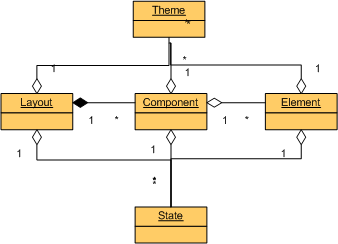

PCSS
=====

**Pragmatic CSS** is my guidelines for writing scalable and maintainable style-sheets. The concept is heavily based on
[SMACSS](https://smacss.com/), [RSCSS](https://github.com/rstacruz/rscss/) and [OOCSS](http://oocss.org/).

# Contents
* [Common Principles](#a-cp)
* [CCSS Abstraction](#a-abs)
* [Naming Conventions](#a-nc)
* [File Structure](#a-fs)
* [Selector Conventions](#a-sc)
* [Examples](#a-ex)

<a id="a-cp"></a>
Common Principles
-------

### Modularity

A complex problem can be broken into simpler tasks. So the entire system becomes easier to debug, update and modify.
Split the whole style-sheet code-base into multiple files so that every file represented a small and reusable module of UI.

### Reusability

Style the components, not a page, so that you could apply once created style an infinite amount of times across the project.
Do not repeat rules while styling, but leverage cascade or mix-in styles

### Loose Coupling (Tag Independence)
Avoid qualified selectors (prepended with tag). Thus you will gain additional agility in moving classes around components.

### Loose Coupling (Location Independence)
Avoid long selectors with descendant/child combinators (.feed nav ul li h2).
Long selectors besides harmful affect on selector performance mean that style rule-set is tied to particular
location in the DOM. Independent selectors allow us to move components around our markup more freely.

<a id="a-abs"></a>
CCSS Abstraction
-------
PCSS is a [Component CSS](http://www.sitepoint.com/introducing-ccss-component-css/) approach that arranges style rules in the following types:



Type|Description
----|----
Layout |Layout specifies the arrangement of elements on a page or in a section.
Component|Component is a small and reusable module of UI, e.i. navigation bar, panel, form.
Element |Element is an atomic building block such as button or field that designed to be easily ported across components.
Theme   |Theme type is reserved for classes alternating existing entity (layout/component/element) like `.table.stripped`, `.form.inline`.
State   |State classes are meant to represent an entity state: `is-selected`, `is-hidden`, `.has-error`.

While styling a new UI, start with elements, then do components and at last layouts. thus you you ensure portability of your styles.

<a id="a-nc"></a>
Naming Conventions
-------

Class name represents entity (layout/component/element) or variant (state/theme). Name for an entity constituent is built of
parent class name and its own one (e.g. `.grid-row`, `.grid-span` where both are parts of `.grid`).
Similarly classes reflect the hierarchy of a type and source file location (e.g. component `.form-nav-search` extends ``.form-nav` and `.form`.
The component source is located in  `Component/Form/Nav/Search` [File Structure](#a-fs))
State classes prefixed with is- or has- (e.g. `.is-hidden`, `.has-success`).

Type|Selector
----|----
Layout/Component/Element |.noun {},.adjective-noun{}
Layout/Component/Element child |.type > .type-noun {}
State |.type.is-state {}, .type.has-state {}
Theme |.type.adjective {}, .type[attribute] {}

Further readings
* [Modular CSS naming conventions](http://thesassway.com/advanced/modular-css-naming-conventions)
* [Naming CSS Stuff Is Really Hard](http://seesparkbox.com/foundry/naming_css_stuff_is_really_hard)

<a id="a-fs"></a>
File Structure
-------

```
Styles
├───Component
│   │   _form.scss
│   │
│   └───Form
│       │   _auth.scss
│       │   _nav.scss
│       │
│       ├───Auth
│       │       _login.scss
│       │
│       └───Nav
│               _search.scss
│
├───Base
│   │   _h5b-normalize.scss
│   │   _base.scss
│   │   _definitions.scss
│   │
│   └───Mixin
│           _media.scss
│
├───Element
│   │   _btn.scss
│   │
│   └───Btn
│           _primary.scss
│
└───Layout
        _grid.scss

```

<a id="a-sc"></a>
Selector Conventions
-------

### Keep selectors short
Remember that browser reads selectors from right to left, long selectors may give it an extra workload. Besides it is
a unwanted contribution to production style-sheet file size. Deep nesting in CSS-preprocessor sources may cause
the described problems even without your awareness. So, keep nesting no more than 3-4 levels.

Avoid `@extend`-ing in SASS/LESS. It adds a long CSS selectors in a compiled code.

### Use classes for styling, IDs and data-attributes to bind JavaScript

IDs can be used in HTML for fragment identifiers and JavaScript hooks, but IDs should never be used in CSS.
Functional element attributes can be quite handy for styling (e.g. input[disabled]), but we rather avoid styling via custom attributes (data-attr)
for a better separation of concerns. When you use only classes for styling and keep IDs and attributes for
JavaScript binding you get much more flexibility in moving styles across the document.


Further Reading

* [When using IDs can be a pain in the class...](http://csswizardry.com/2011/09/when-using-ids-can-be-a-pain-in-the-class/)
* [Code smells in CSS](http://csswizardry.com/2012/11/code-smells-in-css/)


<a id="a-ex"></a>
Examples
-------

#### Layout

Generic grid layout
```
  <div class="grid fluid">
    <div class="grid-row">
      <div class="grid-span2"></div>
    </div>
  </div>
```
where
* `.grid` is a layout,
* `.grid-row` and `.grid-span2` layout children,
* `.fluid` is a theme

Holy Grail layout example borrowed from http://philipwalton.github.io/solved-by-flexbox/demos/holy-grail/
```
  <body class="holygrail">
    <header class="holygrail-header">…</header>
    <div class="holygrail-body">
      <main class="holygrail-content">…</main>
      <nav class="holygrail-nav">…</nav>
      <aside class="holygrail-ads">…</aside>
    </div>
    <footer class="holygrail-footer">…</footer>
  </body>
```

#### Component

A concrete table extending abstract one
```
  <table class="table table-leaderboard">
  ...
  </table>
```
where
* `.table` is a base class (abstract table),
* `.table-leaderboard` is a subclass (concrete table).

A search form of [Boostrap](http://getbootstrap.com/css/#forms)-like markup
```
<form class="form form-nav form-nav-search">
  <div class="form-group has-success">
    <label for="search_form_email">Email address</label>
    <input type="email" class="form-control" id="search_form_email" placeholder="Enter email">
  </div>
...
</form>
```
where
* `.form-nav-search` inherits from `form-nav` and from `.form`,
* `.form-group` and `.form-control` are children of `form` base class and can be augmented for `.form-nav-search`,
* `.has-success` represents field state.


#### Element

Tag-agnostic buttons.
```
  <a class="btn btn-primary" href="#" role="button">Link</a>
  <button class="btn btn-primary" type="submit">Button</button>
  <input class="btn btn-primary" disabled type="submit" value="Submit">
```

where
* `.btn` is a base class (abstract button),
* `.btn-primary` is a subclass (concrete button),
* `.btn-primary[disabled]` is a theme for concrete button disabled state,


#### Context-dependent state

Do not declare a base style for states like `.is-hidden` otherwise you will need to override styles in particular contexts
```
/* Not displayed  */
.context-foo > .is-hidden {
 display: none;
}
/* Visually hidden */
.context-bar > .is-hidden {
  position: absolute;
  overflow: hidden;
  clip: rect(0 0 0 0);
  height: 1px; width: 1px;
  margin: -1px; padding: 0; border: 0;
}
```
JavaScript shall not care about implementation details, it simply toggles the state.
