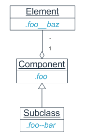
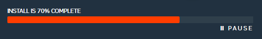
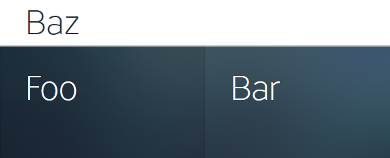
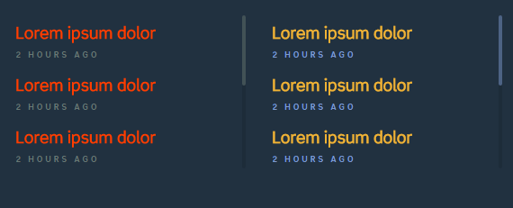

PCSS
=====
ver. 1.2.0

**Pragmatic CSS** is guidelines for writing scalable and maintainable style-sheets. PCSS divides the
whole UI into portable and reusable components and layouts, that may have own
states and depend on themes. Every components and layout is provided with a CSS (SASS/LESS/etc) module.
PCSS naming convention makes it easier to locate a module corresponding to a problem and encourages developer
on producing optimized object-oriented CSS.

PCSS doesn't reveal much unique, but extracts and combines the best parts of existing standards and practices.
It borrows Base, State and Theme rules from [SMACSS](https://smacss.com/), element and subtype (modifier) naming conventions
from  [BEM](https://en.bem.info), the idea of common OOP principles in CSS (inheritance, OCP, SRP)
from [OOCSS](http://oocss.org/), context-independent class names from
[Modular CSS naming conventions](http://thesassway.com/advanced/modular-css-naming-conventions)


# Contents
* [Abstraction](#a-abs)
* [File Structure Example](#a-fs)
* [Naming Conventions](#a-nc)
* [Selector Conventions](#a-sc)

<a id="a-abs"></a>
Abstraction
-------

## Component
Class | Location
----|----
`.panel` | `./Component/_panel.scss`
`.nav-bar` | `./Component/_nav-bar.scss`

**Component** is a reusable module of UI (e.g. `nav-bar`, `panel`, `form`).
Component consists of elements (e.g. `form__title`) and can be extended by subclasses.



#### Element
Class | Location
----|----
`.panel__header` | `./Component/_panel.scss`

Component is built of elements. Elements is an integral parts of a component and
cannot be reused outside of component scope.


#### Subclass
Class | Location
----|----
`.panel--primary` | ./Component/Panel/_primary.scss

Following OOP practices, we inherit from a base component to a its subclass
For example, when we are required of a dialog window, we create `./Component/_dialog.scss` where put the base styles for
any dialogs that we can have within the application. Then we add `./Component/Dialog/_alert.scss` where set the extending styles
for the concrete modal window. Now we refer to a concrete component in the HTML like that:

```
<div class="dialog dialog--alert">..</div>
<div class="dialog dialog--prompt">..</div>
```

#### Themed Component
Class | Location
----|----
`.theme-halogen .foo` | `./Component/_foo.scss`

#### Component Example



##### HTML
```html
<div class="progressbar progressbar--big">
	<output class="progressbar__status">
		Install is 70% complete
	</output>
	<progress class="progressbar__progress" value="70" max="100"></progress>
	<div class="progressbar__actions">
		<div class="icon icon--pause">pause</div>
		<div class="icon icon--play is-hidden">resume</div>
	</div>
</div>
```

##### ./Component/_progressbar.scss
```sass
.progressbar {
  position: relative;
}
.progressbar__progress {
  border: 0;
  position: absolute;
  width: 100%;
  bottom: 0;
  left: 0;
  appearance: none;
  &::-webkit-progress-bar {/*..*/ }
  &::-webkit-progress-value {/*..*/ }
  &::-moz-progress-bar {/*..*/ }
}
.progressbar__status {
  display: flex;
  position: relative;
  font-size: 1rem;
}
.progressbar__actions {
  position: absolute;
  bottom: 0;
  right: 0;
  > .icon { /*..*/ }
}
```

##### ./Component/Progressbar/_big.scss
```sass
.progressbar--big > .progressbar__status {
  font-size: 1.6rem;
  text-transform: uppercase;
  padding: 16px;
}
```
##### ./Component/Progressbar/_small.scss
```sass
.progressbar--small > .progressbar__status {
  font-size: 1.1rem;
  text-transform: lowercase;
  padding: 11px;
}
```


## Layout

Class | Location
----|----
`.l-app` | ./Layout/_app.scss

Layout specifies how the components are arranged in a given context.

#### Subclass
Class | Location
----|----
`.l-app--home` | ./Layout/App/_home.scss


#### Themed Layout
Class | Location
----|----
`.theme-halogen .l-app` | ./Layout/_app.scss

#### Layout Example



##### HTML
```html
<div class="l-app">
  <header>
   Baz
  </header>
  <div class="l-app__body">
    <aside class="l-app__aside">Foo</aside>
    <div class="l-app__main">Bar</div>
  </div>
</div>
```

##### ./Layout/_app.scss
```sass
.l-app {
  display: flex;
  min-height: 100vh;
  flex-direction: column;
}
.l-app__body {
  flex-direction: row;
  display: flex;
  flex: 1;
}
.l-app__aside {
  flex: 1 1 40%;
}
.l-app__main {
  flex: 1 1 60%;
}
@media (max-width: 768px) {
  .l-app__body {
    flex-direction: column;
    flex: 1;
  }
}
```


## State
State classes are intended to represent a UI unit state: `.is-expanded`, `.is-hidden`, `.has-error`.

##### HTML
```html
<div class="l-main has-error">
<aside class="sidebar is-hidden">...</aside>
</div>
```

##### ./Layout/_main.scss
```css
.l-main {
  /* default style */
  &.has-error {
    /* state modified style */
  }
}
```

##### ./State/_global.scss
```css
/* Global state */
.is-hidden {
  display: none !important;
}
```


## Theme
Theme classes used to alternate the style of a component or a layout
depending on the context.

##### HTML
```html
<html class="theme-foo">
  <div class="l-main">
  <aside class="sidebar">...</aside>
  </div>
</html>
```

##### ./Component/_sidebar.scss
```css
.sidebar {
/* default style */
}
.theme-foo .sidebar {
/* alterntive style */
}
```

#### Programmatic Theming

If we need components to change styles according to a set theme (`.theme-baz` and
`.theme-qux`), we can use a mixin like:

```sass
@mixin theme-dialog($theme) {
  $bg: get-theme-style($theme, "bg");
  .theme-#{$theme} .dialog {
    background-color: #{$bg};
  }
}
@each $theme in $themes {
  @include theme-dialog($theme);
}
```

Where we have in `./Base/_defenitions.scss`:
```sass
$themes: baz qux;
@function get-theme-style($theme, $key) {
  $baz-map: (
    "bg": $baz-bg
  }
  $qux-map: (
    "bg": $qux-bg
  }
  @if $theme == "baz" {
    @return map-get( $baz-map, $key );
  }
  @if $theme == "qux" {
    @return map-get( $qux-map, $key );
  }
  @return map-get( $baz-map, $key );
}
```

#### Theme Example



```html
<div class="theme-foo">
  <article class="entry">
    <h2 class="entry__heading">Lorem ipsum dolor</h2>
    <time datetime="2008-02-14 20:00" class="entry__time">2 hours ago</time>
  </article>
  <article class="entry">
    <h2 class="entry__heading">Lorem ipsum dolor</h2>
    <time datetime="2008-02-14 20:00" class="entry__time">2 hours ago</time>
  </article>
  <article class="entry">
    <h2 class="entry__heading">Lorem ipsum dolor</h2>
    <time datetime="2008-02-14 20:00" class="entry__time">2 hours ago</time>
  </article>
</div>

<div class="theme-halogen">
...
</div>
```

<a id="a-fs"></a>
File Structure Example
-------

```
Styles
├───Component
│   │   _form.scss
│   │
│   └───Form
│       │   _auth.scss
│       │   _nav.scss
│       │
│       ├───Auth
│       │       _login.scss
│       │
│       └───Nav
│               _search.scss
│
├───Base
│   │   _h5b-normalize.scss
│   │   _base.scss
│   │   _definitions.scss
│   │
│   └───Mixin
│           _media.scss
│
│
└───Layout
        _grid.scss

```


<a id="a-nc"></a>
Naming Conventions
-------

* Class name represents source location. Let's say styles for `.form--nav--search` is expected in the file
`Component/Form/Nav/_search.scss` [File Structure](#a-fs)).
* Layout classes are prefixed with `l-`.
* State classes are prefixed with `is-` or `has-` (e.g. `.is-hidden`, `.has-success`).
* Theme classes are prefixed with `theme-`.

Class | Entity
----|----
`.btn`, `.main-nav` | a component (only hyphen delimited names)
`.main-nav__title` | element (subcomponent)
`.btn--primary`, `.main-nav--landing-page` | subclass
`.is-hidden`, `.has-success` | a state
`.l-holygrail` | a layout
`.theme-default`, `.theme-garland` | a theme


##### Further readings
* [Modular CSS naming conventions](http://thesassway.com/advanced/modular-css-naming-conventions)
* [Naming CSS Stuff Is Really Hard](http://seesparkbox.com/foundry/naming_css_stuff_is_really_hard)

<a id="a-sc"></a>
Selector Conventions
-------

### Keep selectors short
Remember that browser reads selectors from right to left, long selectors may give it an extra workload. Besides it is
a unwanted contribution to production style-sheet file size. Deep nesting in CSS-preprocessor sources may cause
the described problems even without your awareness. So, keep nesting no more than 3-4 levels.

Avoid `@extend`-ing in SASS/LESS. It adds a long CSS selectors in a compiled code.

### Use classes for styling, IDs and data-attributes to bind JavaScript

IDs can be used in HTML for fragment identifiers and JavaScript hooks, but IDs should never be used in CSS.
Functional element attributes can be quite handy for styling (e.g. input[disabled]), but we rather avoid styling via custom attributes (data-attr)
for a better separation of concerns. When you use only classes for styling and keep IDs and attributes for
JavaScript binding you get much more flexibility in moving styles across the document.


### Loose Coupling (Tag Independence)
Avoid qualified selectors (prepended with tag). Thus you will gain additional agility in moving classes around components.

### Loose Coupling (Location Independence)
Avoid long selectors with descendant/child combinators (.feed nav ul li h2).
Long selectors besides harmful affect on selector performance mean that style rule-set is tied to particular
location in the DOM. Independent selectors allow us to move components around our markup more freely.


##### Further Reading

* [When using IDs can be a pain in the class...](http://csswizardry.com/2011/09/when-using-ids-can-be-a-pain-in-the-class/)
* [Code smells in CSS](http://csswizardry.com/2012/11/code-smells-in-css/)

[](http://githalytics.com/dsheiko/pcss)